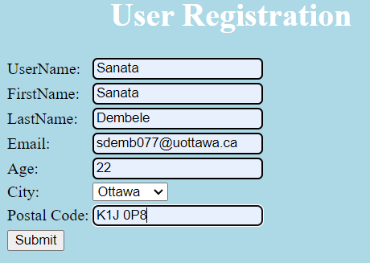
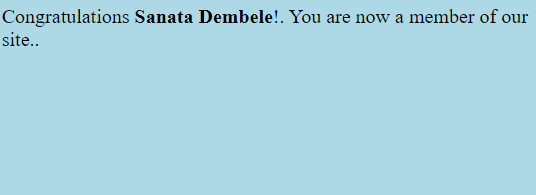
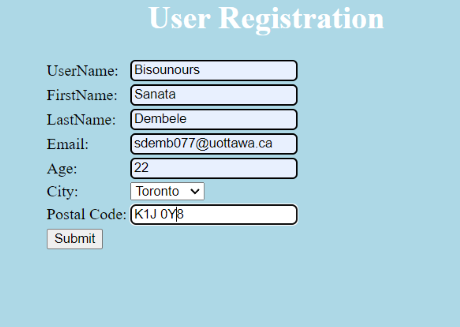
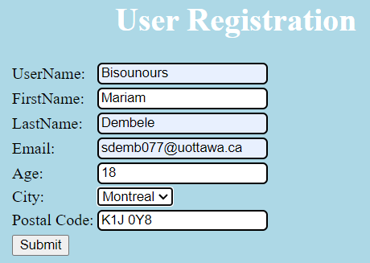
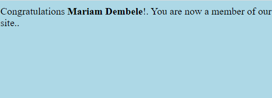
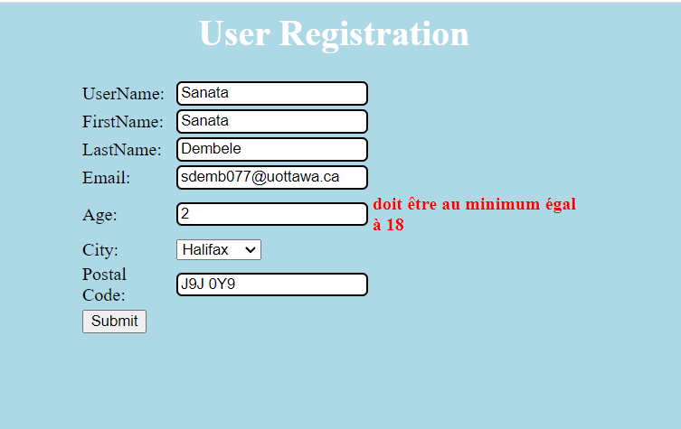
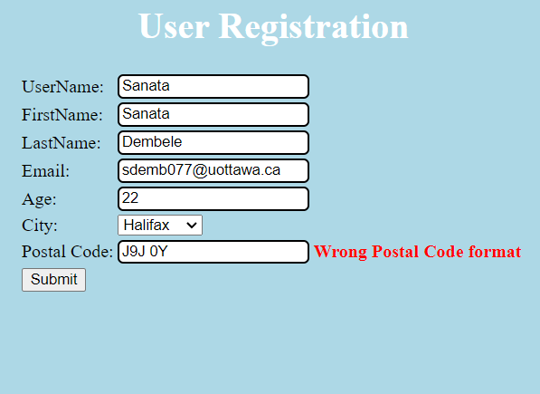

# Lab2
# seg3503_playground
| Outline | Value |
| --- | --- |
| Course | SEG 3503 |
| Date | Summer 2023 |
| Professor |  Mohammed Ibrahim  |
| TA | Joseph Abonasara  |
| Team | Sanata Dembele 300237772   Lolita Inabeza 300218895|
# Exercise 1
| Test Case  | Expected Results   | Actual Results  | Verdict(Pass,Fail,Inconclusive)  |   
|------|------|------|------|
|  1 | accepted  | accepted     | Pass   |   |
|  2 | accepted  | accepted      | Pass |   |
|  3 | accepted  | accepted        | Pass  |   |
|  4 | Err1  | Err1 and Err3    | Fail  |   |
|  5 | Err3  | Err1 and Err3    | Fail  |   |

# Exercice 2
Output from running the test.
 ![image] (Photo/Output for running test.png)

 Test Run using bin/test
 ![image] (Photo/test run using bin.png)

 Typical explicit test case that doesn’t use exception.
 ![image] (Photo/DateTest-noException.png)

 Explicit test cases that have exceptions.
 ![image] (Photo/DateTest-withException.png)

 Parameterized test values for test cases that run OK and return a Date.
 ![image] (Photo/Ok-valuesForParamateurizedTest.png)

 Test case with parameterized test values that run Ok
 ![image] (Photo/Test for parameteurized exception.png)

 Parameterized test values for tests cases that do result in an exception.
 ![image] (Photo/Exception-valuesForParameteurizedTest.png)

 Test case with parameterized test values that do result in an exception
 ![image] (Photo/Test for parameteurized noexception.png)

