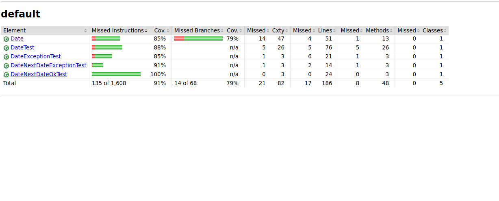
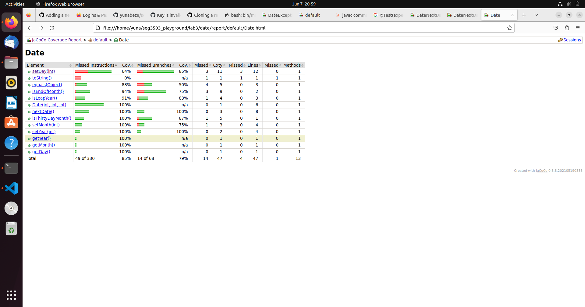
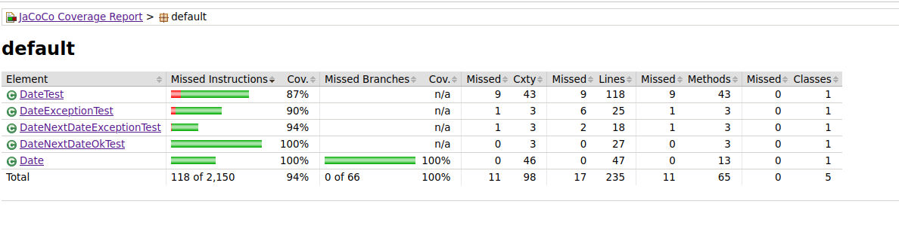
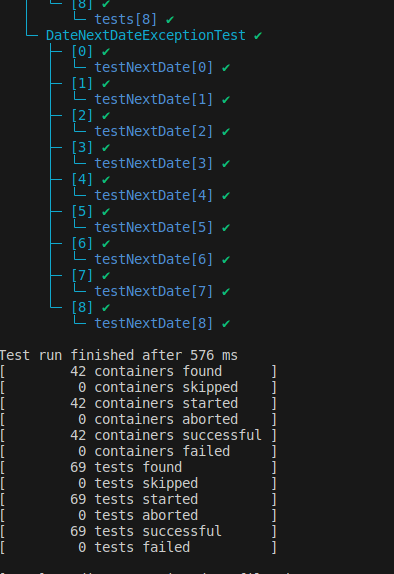
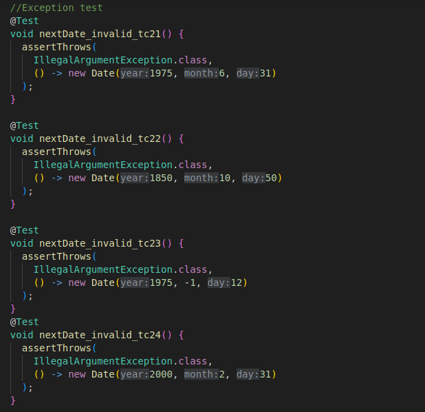
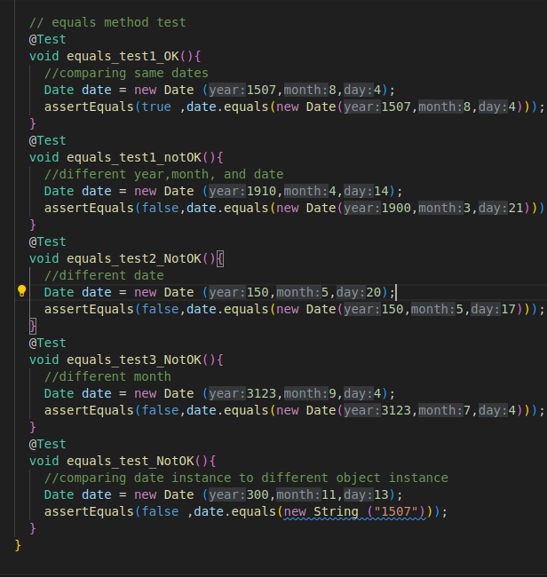
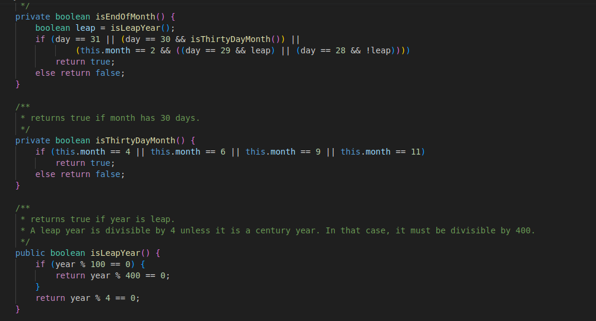
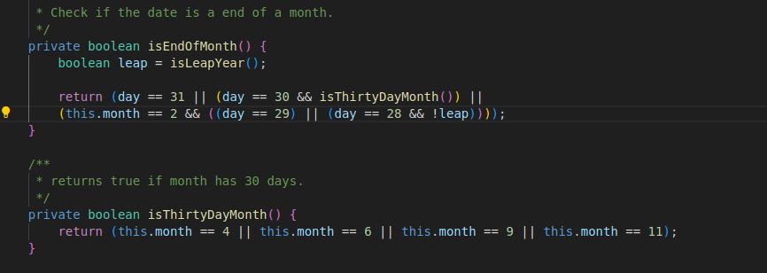

# Lab3
# seg3503_playground
| Outline | Value |
| --- | --- |
| Course | SEG 3503 |
| Date | Summer 2023 |
| Professor |  Mohammed Ibrahim  |
| TA | Joseph Abonasara  |
| Team | Sanata Dembele 300237772   Lolita Inabeza 300218895|

 
## Date coverage before

  

## Code coverage after

  

__tests results after adding new tests and refactoring date.java__
  

## Added tests to achieve full coverage

  
   
   

## Date.java refactoring 

 

 
