# Lab 4
# seg3503_playground
 

| Outline | Value |
| --- | --- |
| Course | SEG 3503 |
| Date | Summer 2023 |
| Professor | Mohamed Ibrahim |
| TA | Joseph Abonasara  |
| Name | Lolita Inabeza 300218895|

 
 

## My commits

Test1, test2, test3, and test4 are implemented to test how the FizzBuzzOrNum method works
  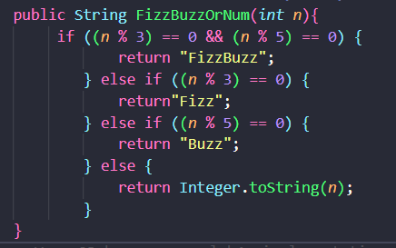
    Test5 tests the generator(n,m) method
  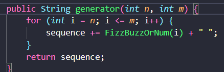

| Commit name | Commit number | Commit description |
| --- | --- | --- |
| test 1 failing     updated bin/test| 51af667aac1dd2aad3fb977810d5342930dd126c     a465c2ba3e77b104acf81f51e947261e02ca7402 | Fail   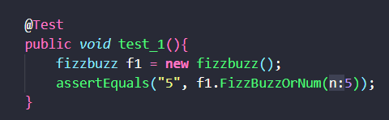     Pass   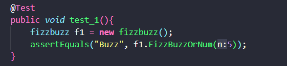|
| added Test2 which is failing      test2 is successful | 35a14114d73590e72a61abc17cf1fca320e46160     96bcbaad4f24ff17d5b24144a306689d183842b9 | Fail   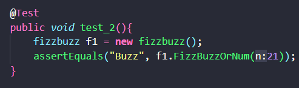     Pass   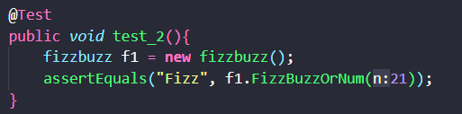|
| test3 is failing     test3 is successful | a9a389d7f5151bc445dd4b47ce12a98a895191a4     b8f0c4eaf3eb8aa99ecb9d4349af0c3ee53d867b | Fail   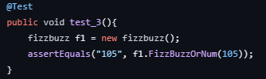     Pass   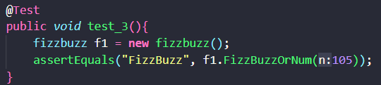 |
| test4 is failing     test4 is successful | d3278a49e88261d5f5d2a2250a7ad68d7b8866e3     c1ecf228f6724d89418655e0da78533557586e6b | Fail   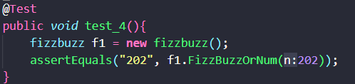     Pass   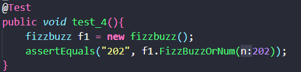 |
| test5 is failing     test5 is successful | 80291f8a9fd250ba22d062202238947b8f2bde4f     c3d6f7f26fe194686b07e78004ebbff7d6978e9b | Fail   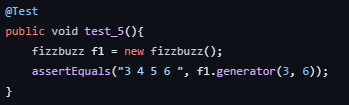    Pass   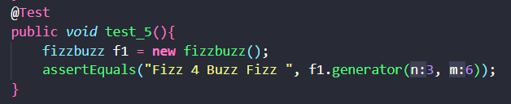 |

  

### Code Refactoring

After refactoring the code, tests kept giving the same results    
**Before refactoring**
  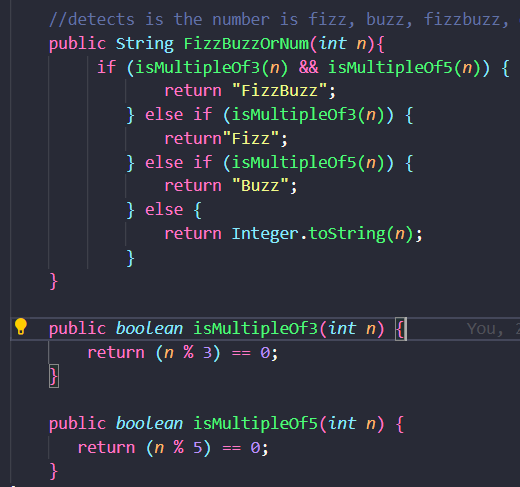
  Results
  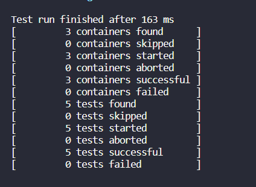    

**After refactoring**
  
  Results
  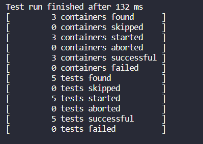
