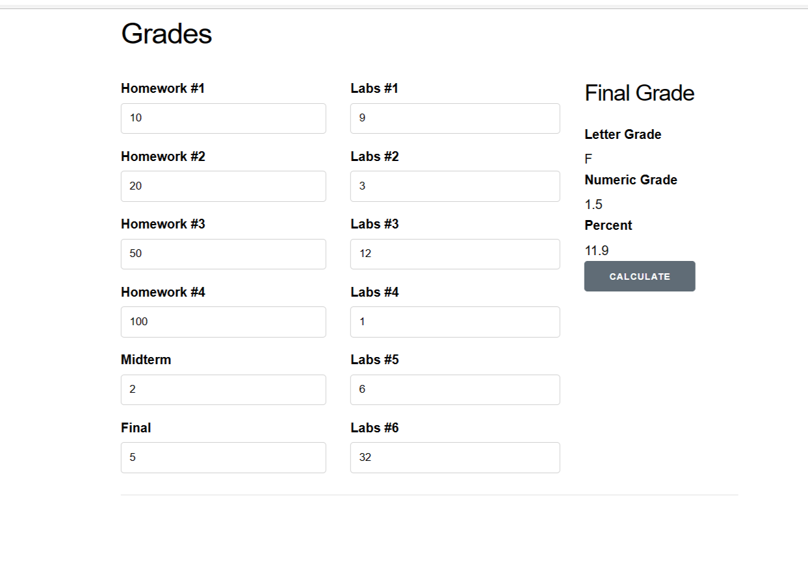

# Lab5
# seg3503_playground
| Outline | Value |
| --- | --- |
| Course | SEG 3503 |
| Date | Summer 2023 |
| Professor | Mohammed Ibrahim  |
| TA | Joseph Abonasara  |
| Team | Sanata Dembele 300237772   Lolita Inabeza 300218895|

 

## Grades
Au début lorsqu'on clique sur le  bouton Calculate aucun résultat ne s'affiche. Après des modifications de grades.ex on obtient le code final suivant:
 

 

À travers quelques test, nous pouvons apercevoir que l’application web nous affiche les valeurs prévues. Le back-end ainsi que le front-end fonctionnement comme attendu.  
 

 

## Twitter

### Implementation des 4 cas de test manquantes

 

    

**Resultats de ces tests**
 

 

### Analyse des resultats des tests

En examinant les resultats des tests, on voit premièrement qu'une exception apparaît lorsque il n'y a aucun tweet (null), cela est dû au fait que isMentioned va vérifier tweet.contains("@"+ name), hors tweet aura la valeur null qu'on ne peut pas referencer d'où l'exception. Pour resoudre cela, on fait en sorte que si il n' y a aucun tweet isMentionned retournera toujours false.
    
Deuxièmement, en analysant les resultats que donne le test isMentionned_dontReturnSubstringMatches, on voit que quand le tweet est 'hello @meat' isMentionned trouve que 'me" fait partie du tweet, cela veut dire dans  isMentionned la ligne 'tweet.contains("@"+ name)' vérifie juste que la suite de caractères '@me' est dans le tweet, ce qui est vrai mais n'est pas valide pour notre implementation. Donc pour avoir le resultat qu'on souhaite on doit comparer les deux mots soit '@meat' et '@me' en tant que String.
     
ci-bas vous pourrez voir la nouvelle implementation de isMentionned et les résultats des tests

### Code refactoring

**Résultats des tests**
    

