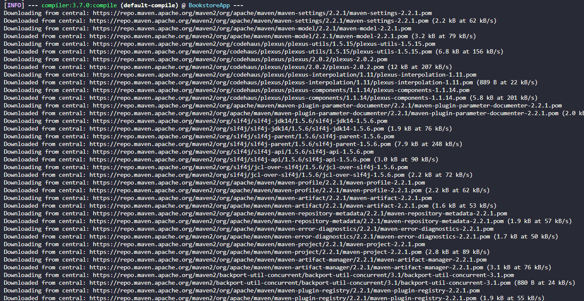

# Lab6
# seg3503_playground
| Outline | Value |
| --- | --- |
| Course | SEG 3503 |
| Date | Summer 2023 |
| Professor |  Mohammed Ibrahim  |
| TA | Joseph Abonasara  |
| Team | Sanata Dembele 300237772   Lolita Inabeza 300218895|

## Output of mvn --version
  
 

## Output of mvn compile
  
  
  
 

## Output of mvn package -DskipTests
  
  
 

## Output of java -jar ./target/BookstoreApp-0.1.0.jar
  
  This command is supposed to launch the server but when we tried to access it through the browser it did not work. Instead, we used the command -jar bookstore5.jar 

## Output of java -jar bookstore5.jar
  
  With this command we accessed successfully the application through the browser.
 

## Application screenshots
  
  
 <
 

## Output of mvn test
  
 

## One additional selenium web driver test
  
 
This test checks that the number of times we click on the button "add to cart" (ajouter au panier) for a certain book, will correspond to the number of copies of that book on the order page (checkout page)

## Output of mvn test for the new test
  
 
