# Lab7
# seg3503_playground
| Outline | Value |
| --- | --- |
| Course | SEG 3503 |
| Date | Summer 2023 |
| Professor |  Mohammed Ibrahim  |
| TA | Joseph Abonasara  |
| Team | Sanata Dembele 300237772   Lolita Inabeza 300218895|

## Spotbugs Interface
  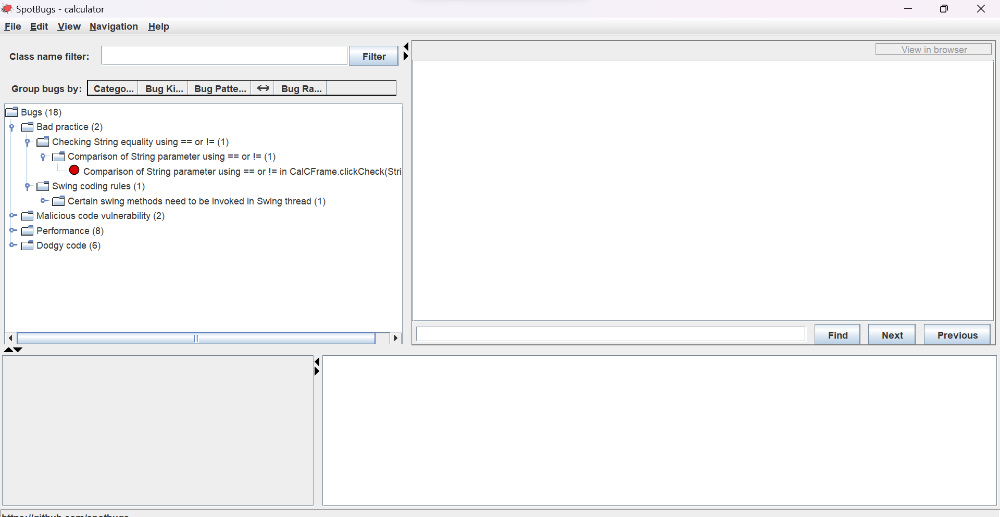
 
## Calculator Interface
  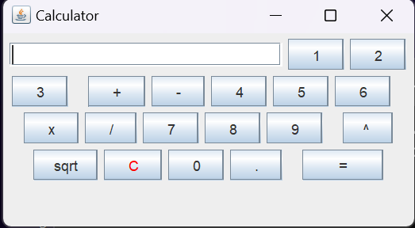
 
## Bug 1: Comparison of String parameter using == or !=
 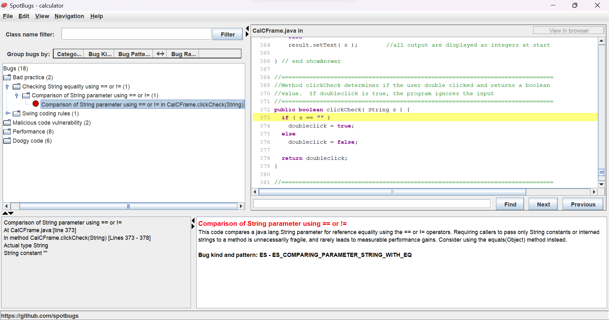
  Description: a bug can arise from using == or != for comparing String content is related to reference equality instead of content equality.
  **After fixing the bug**  
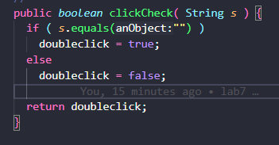
 
## Bug 2: Certain swing methods to be invoked in the Swing thread
 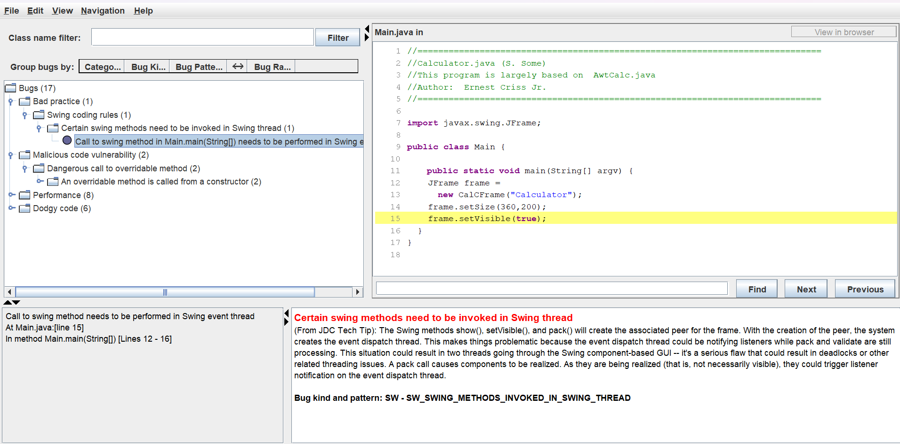
  Bug description: The issue occurs in Swing when using methods like show(), setVisible(), and pack(). When these methods are called, the associated peer for the frame is created, and the event dispatch thread is also created. This creates a problem because the event dispatch thread might notify listeners while pack() and validate() methods are still processing. This can lead to two threads simultaneously accessing the Swing component-based GUI, resulting in deadlocks
## Bug 3 and 4: An overridable method is called from the constructor
 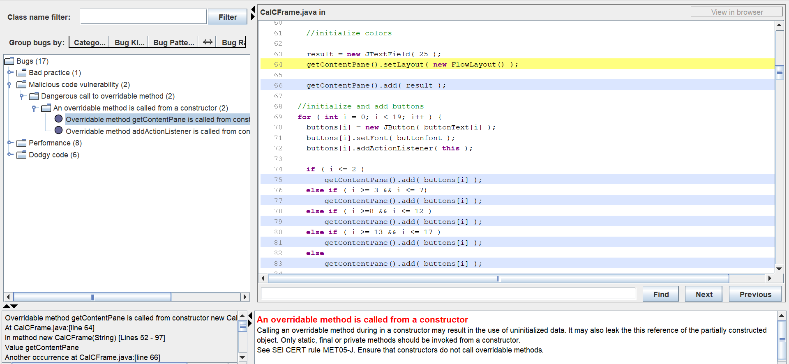
 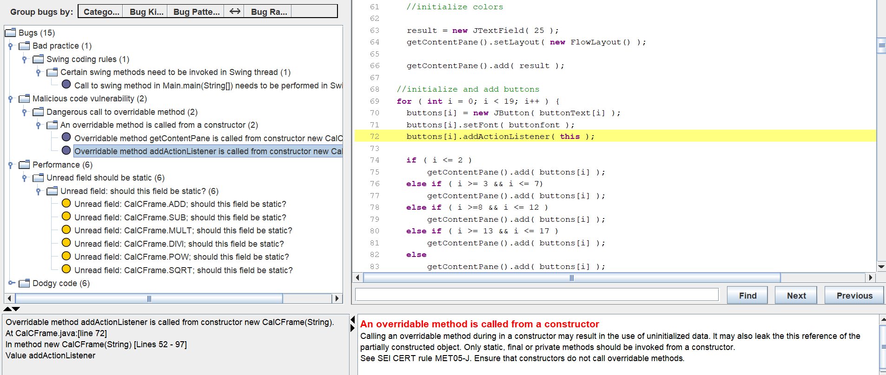
  Description to fix the bugs: These two bugs are due to the call in the constructor of new WindowAdapter which will call addActionlistener and getContentPane, to solve it is better to create a static class to invoke the new WindowAdapter, then reference that class in the constructor of calcFrame
## Bug 5 and 6: Boxing/unboxing to parse a primitive
 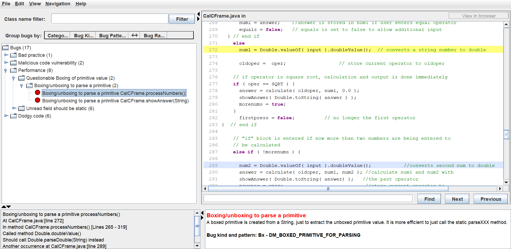
 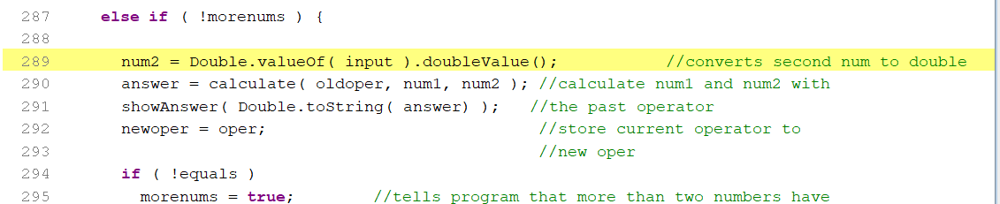
 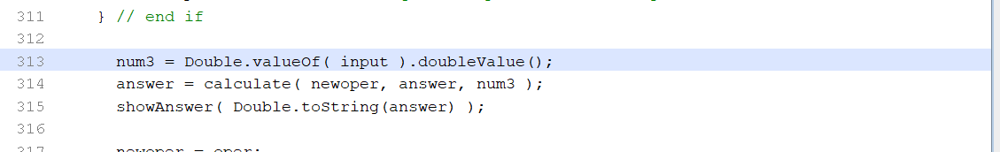
 **After fixing the bug**
 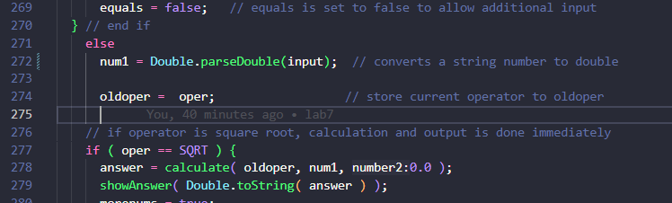
 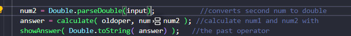
 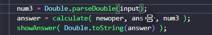
 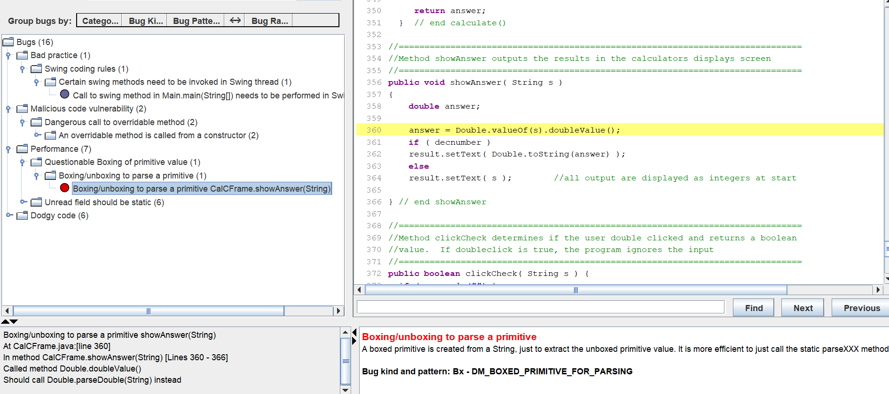
 **After fixing the bug**
 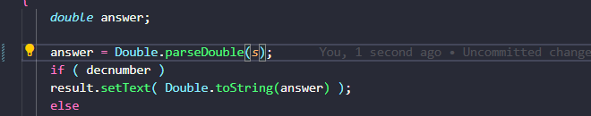
  Bug fix description : replaced Double.valueOf() with Double.parseDouble for efficiency
 
## Bugs 7-12: Unread field: should this field be static
 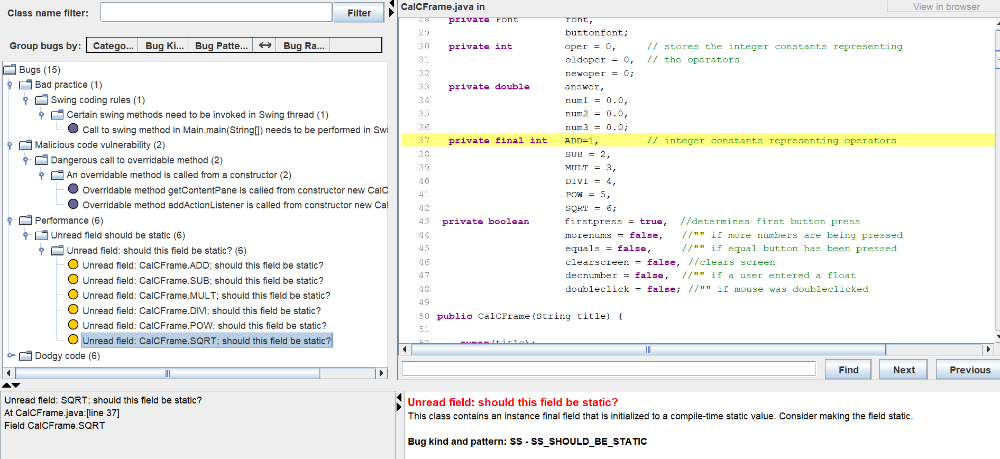
 **After fixing the bug**
 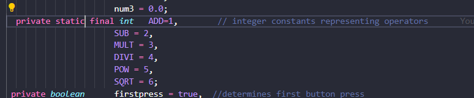
  Bug fix description: The variables were just put as static.
 
## Bug 13 and bugs 15-17: method uses the same code for two branches and Condition has no effect
 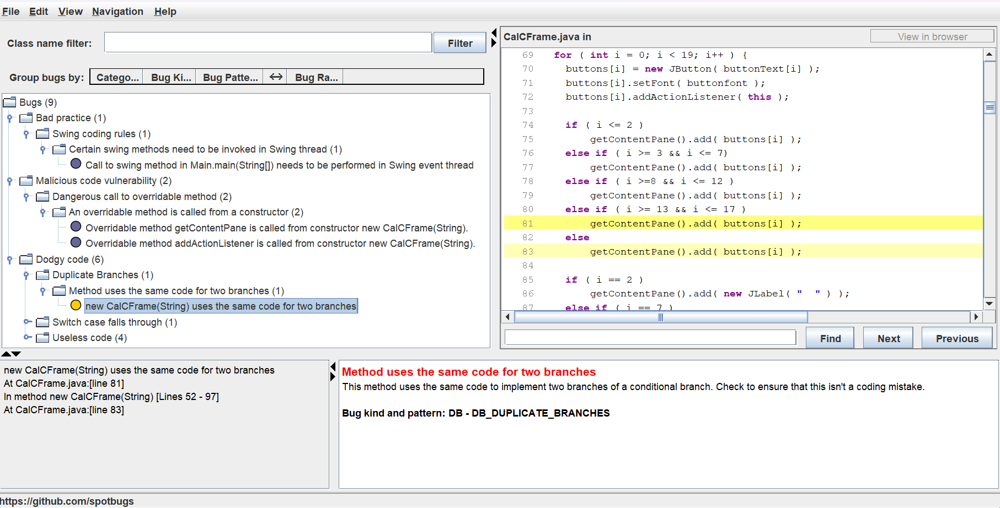
 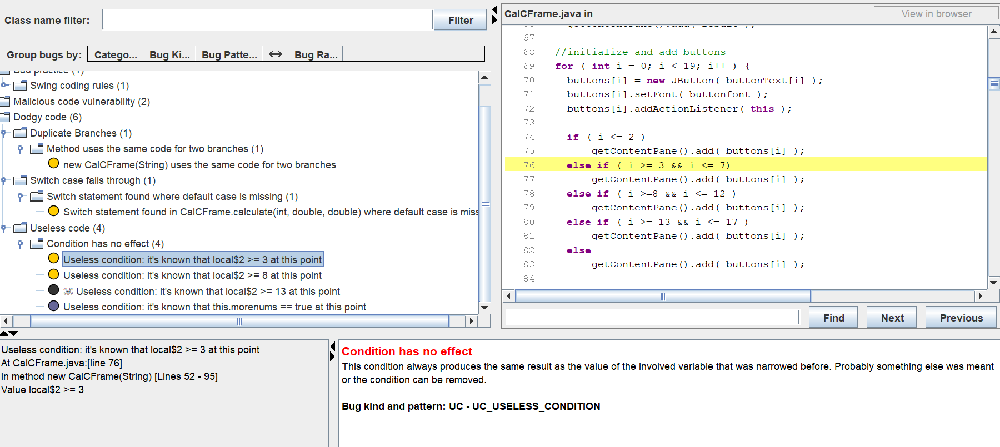
  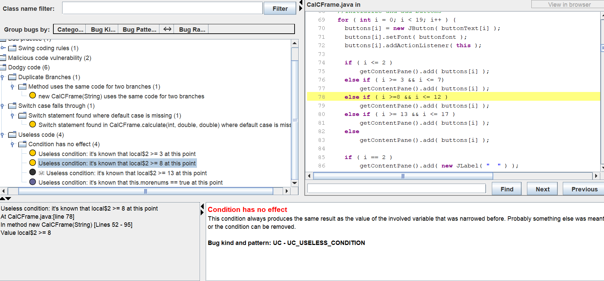
 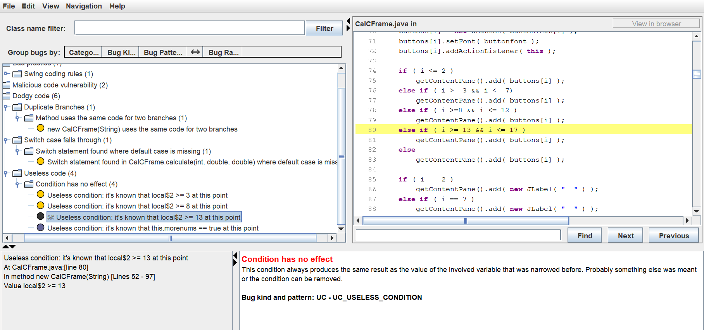
 **After fixing the bugs**
  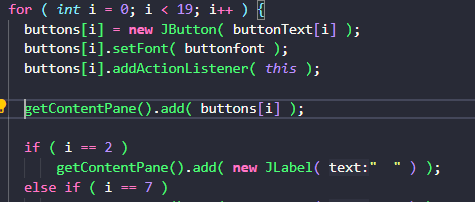
  These bugs were fixed at once, as the whole if - else if - else block was unnecessary since adding the buttons to getCotentPane does not the depend of i's value
 
## Bug 14: Switch statement found where default case is missing
 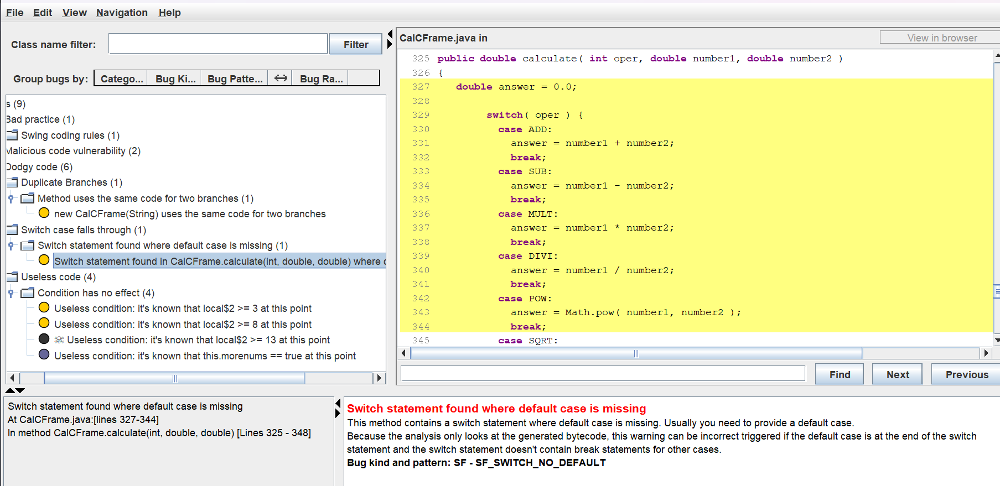
 **After fixing the bug**
  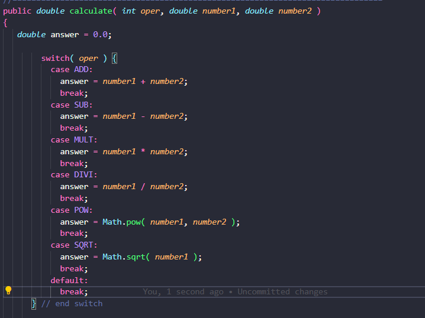
  Bug fix description: Added default case
 
## Bug 18: Condition has no effect
 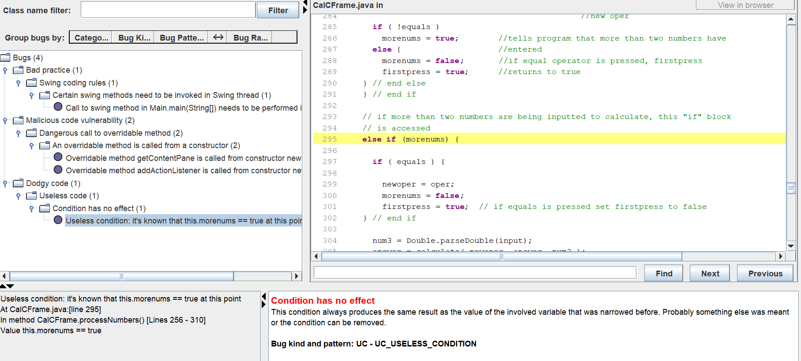
 **After fixing the bug**
  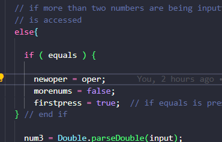
 Bug fix Description: At this point, morenums is True, else if(morenums) is replaced to else.
 
## Final results of the analysis
  As only 15 bugs were fixed, we are left with 3 bugs
 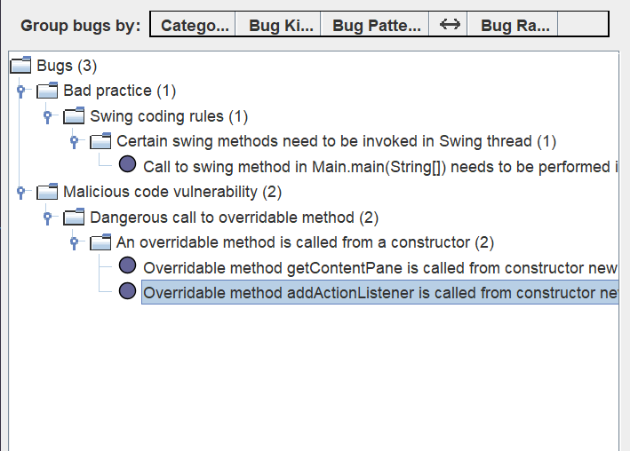
